# MercadoLibre Challenge Application — Diagramas de Diseño

Este documento resume la arquitectura y los flujos clave de la API (Spring Boot 3.5.6, Java 21 VT, persistencia JSON con CAS). Los diagramas están en **Mermaid** para que puedas renderizarlos en GitHub, VS Code, Obsidian o tu wiki.

---

## 1) C4 — Contexto (Nivel 1)

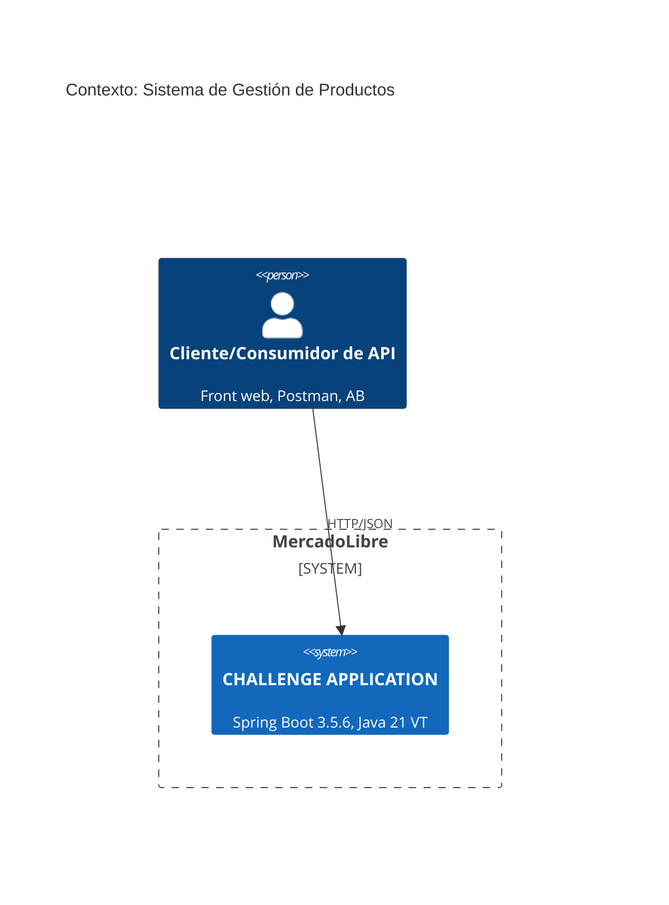

---

## 2) C4 — Contenedores (Nivel 2)

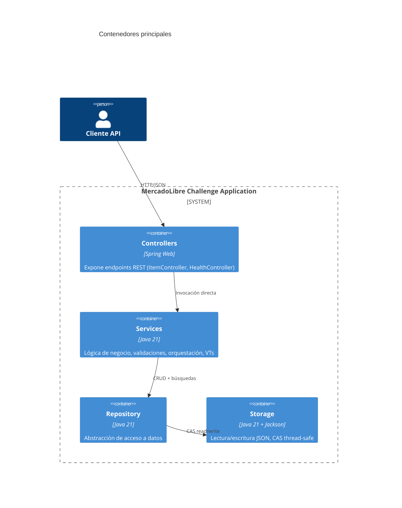

---

## 3) C4 — Componentes (Nivel 3)

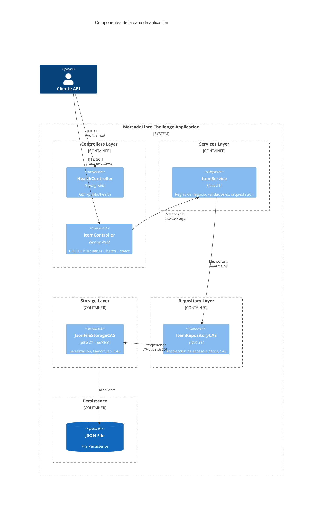

---

## 4) Diagramas de Secuencia — Flujos Completos

### 4.1) Health Check

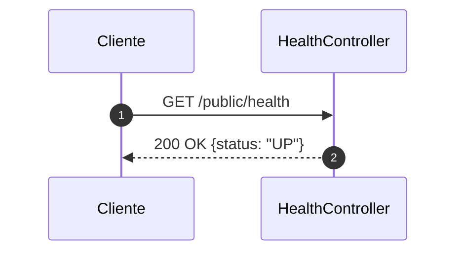

### 4.2) Create Item

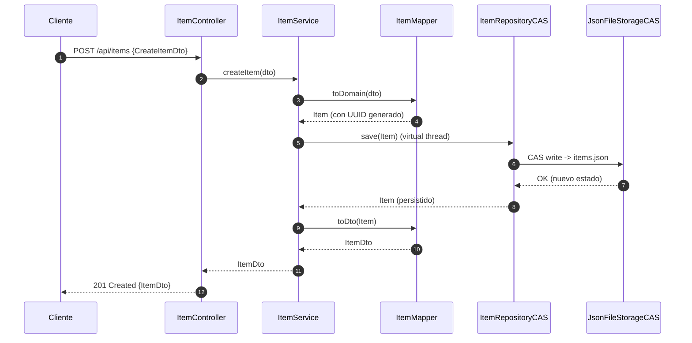

### 4.3) Read Item (Get by ID)

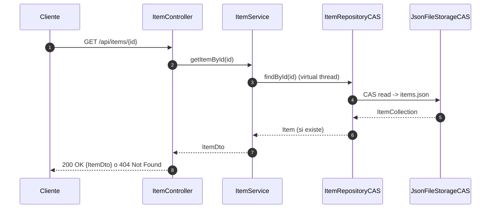

### 4.4) Read All Items

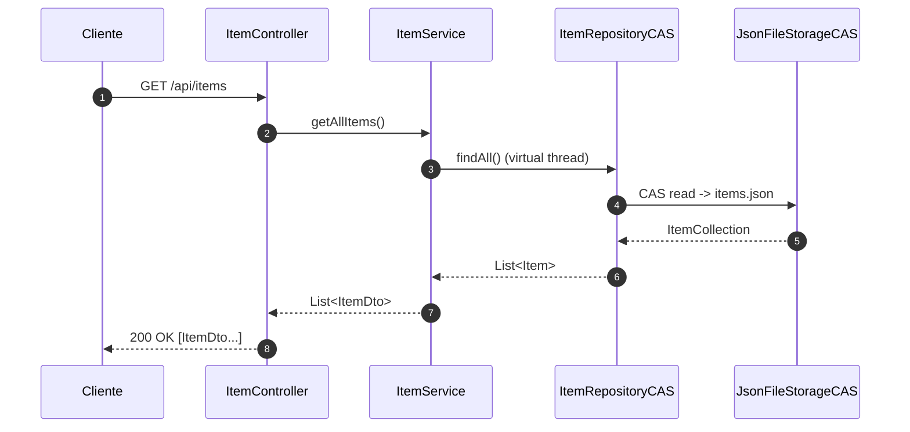

### 4.5) Update Item (PUT)

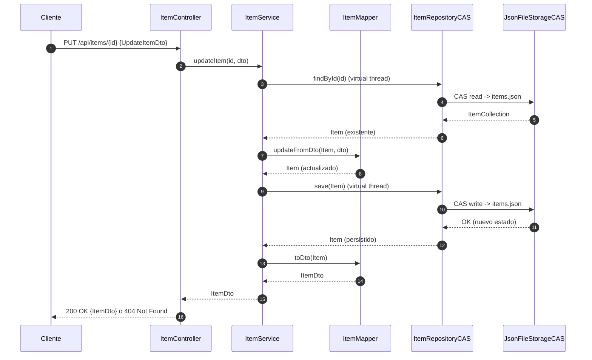

### 4.6) Patch Item (PATCH)

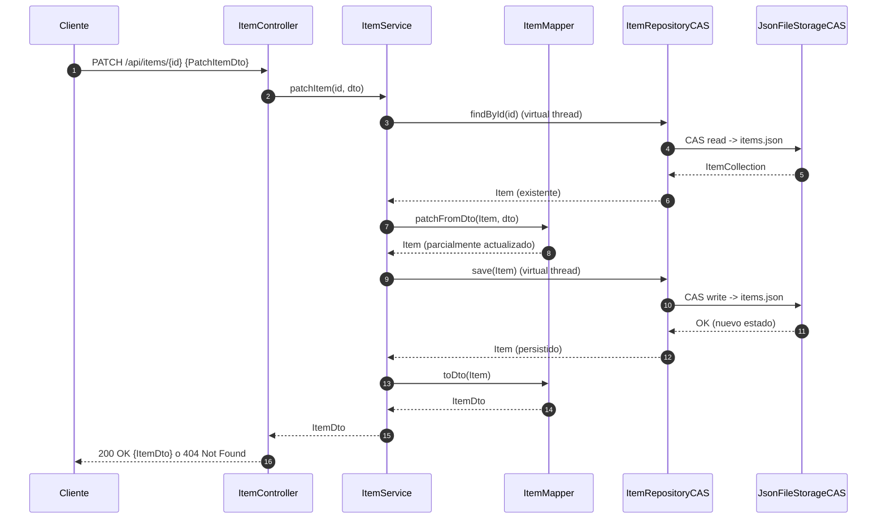

### 4.7) Delete Item

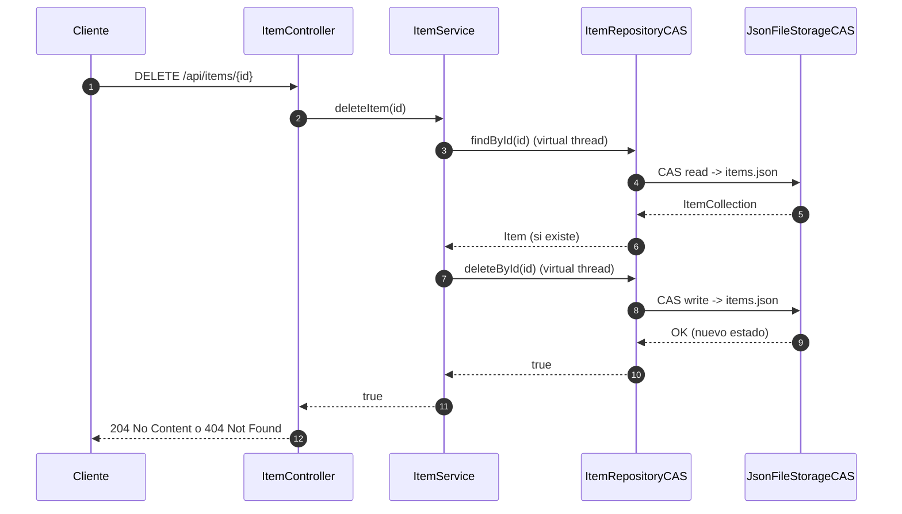

### 4.8) Search by Name

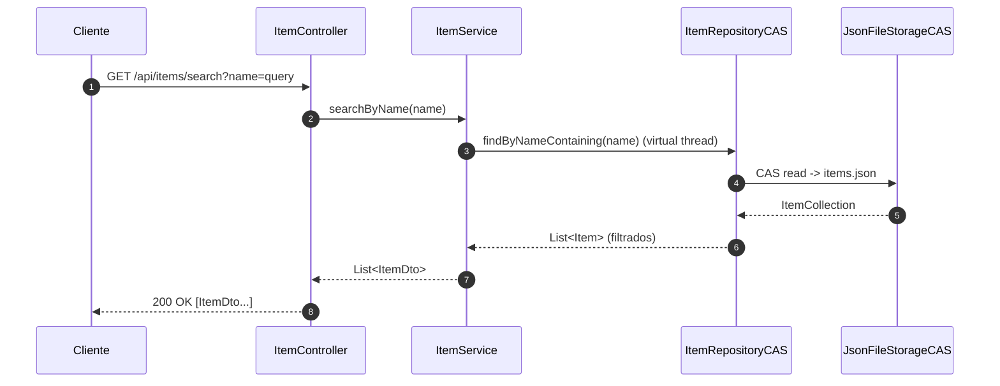

### 4.9) Search by Rating

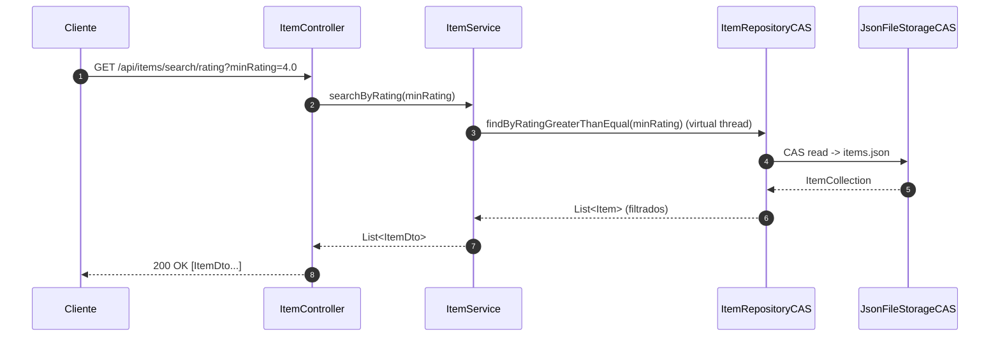

### 4.10) Search by Price Range

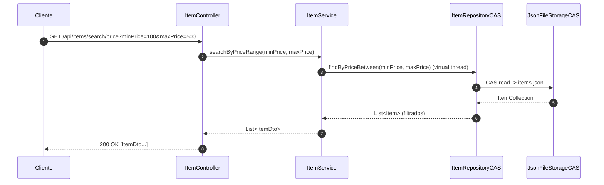

### 4.11) Count Items

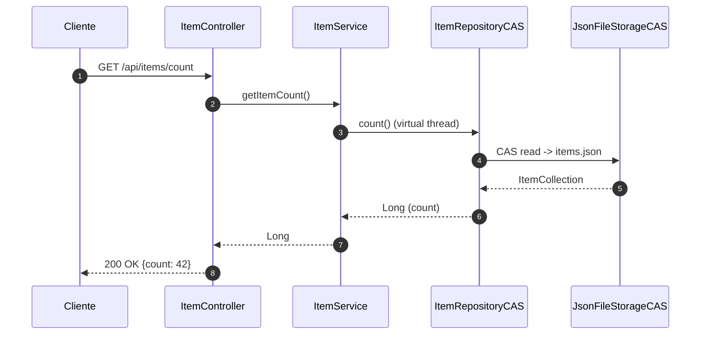

### 4.12) Batch Read Items

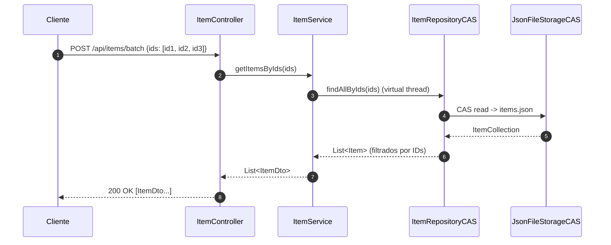

### 4.13) Add Specifications

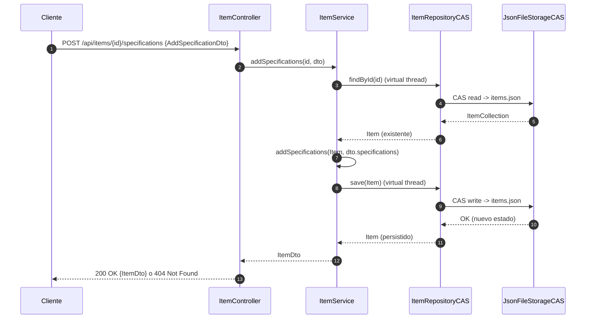

---

## 5) Concurrencia — CAS y Virtual Threads

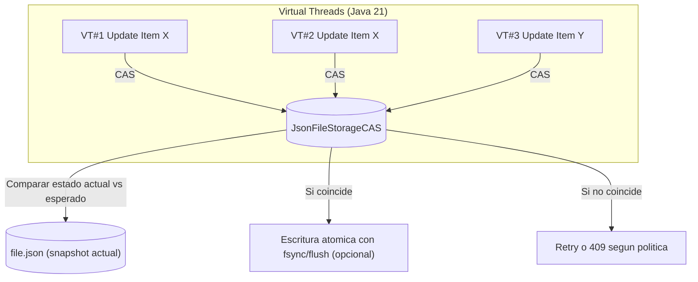

**Notas**  
- **CAS** evita condiciones de carrera sin locks globales largos.  
- **VT** permite gran cantidad de operaciones concurrentes con bajo overhead.  

---

## 6) Modelo de Datos (ER básico)

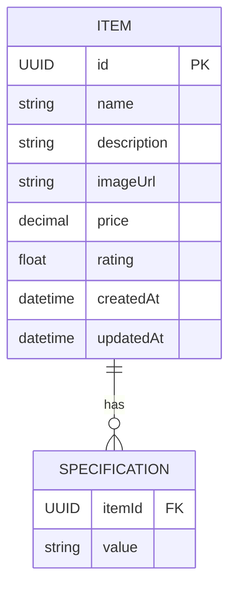

> Implementación real: `ItemCollection` utilizando `ConcurrentHashMap<UUID, Item>`; serialización **custom** para preservar estructura de mapa en JSON.

---

## 7) Endpoints — Mapa lógico

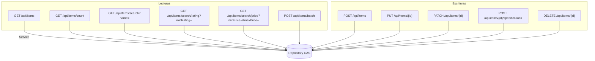

---

## 8) Despliegue Monolítico

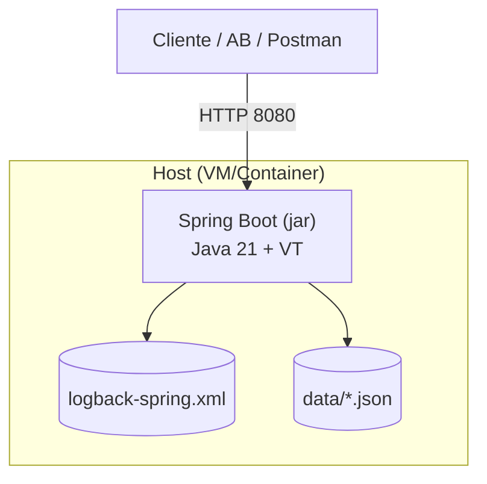

---

## 9) Performance — Lecturas y Concurrencia

```mermaid
graph TD
    A[Lecturas típicas] --> B[p50 ~ 12 ms]
    A --> C[p99 ~ 22 ms]
    D[Concurrencia] --> E[Estable hasta ~200 usuarios]
    E --> F[Degradación desde ~200]
    F --> G[Límite alrededor de ~500]
    G --> H[Fallo cerca de ~2000]
```

> Datos a modo ilustrativo para contextualizar el diagrama, basados en los reportes de Apache Benchmark.

---

## 10) Manejo de Errores

```mermaid
flowchart TD
    subgraph API
      X[GlobalExceptionHandler]
      Y[Custom Exceptions]
    end
    Req[Request inválido] --> Y --> X --> Resp[HTTP 4xx JSON]
    Err[Error interno] --> X --> Resp5[HTTP 5xx JSON]
```

**Beneficios**: respuestas homogéneas, logging centralizado, trazabilidad.

---

## 11) Patrones Clave

- **Repository Pattern**: swap de persistencia sin impactar capa de negocio.  
- **Service Layer**: testabilidad, separación de concerns.  
- **DTO + Mapper**: versionado, contratos claros, serialización controlada.  
- **Global Exception Handler**: errores consistentes.  
- **CAS + VT**: concurrencia eficiente sin locks gruesos.

---
